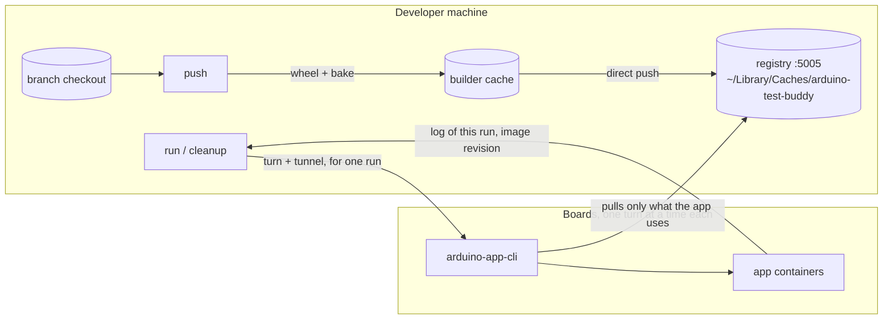

# arduino-test-buddy

Test App Bricks on a real Arduino board from your machine. One binary, two faces: a CLI for you and CI, an MCP server for Claude Code and other agents. Same operations, same structured results.

It replaces the SSH juggling of a board test session with a handful of calls that cannot step on each other. Images are built once on your machine and pushed to a registry there; each board pulls only what its apps use, through a tunnel that lives for one run. Sessions sharing a board take turns, every `arduino-app-cli` call is serialized, logs come back cut to the current run, and cleanup removes only what the session created. Everything the tool keeps on your machine is one folder and one builder, both removable with one command.

## Install

Needs macOS or Linux (Windows through WSL), Go 1.26, Docker with buildx, [Task](https://taskfile.dev), uv, and an SSH alias for each board in `~/.ssh/config`.

```console
$ go install github.com/robgee86/arduino-test-buddy/cmd/arduino-test-buddy@latest
$ claude mcp add --scope user arduino-test-buddy -- arduino-test-buddy mcp   # optional, for Claude Code in every project
```

## Quickstart

From an `app-bricks-py` checkout of the branch to test:

```console
$ arduino-test-buddy push                                        # wheel + every image, pushed to the registry on this machine; prints the tag
$ arduino-test-buddy --board ventunoq --tag my-branch preflight  # disk, CLI, apps, images, devices, as facts
$ arduino-test-buddy --board ventunoq --tag my-branch run --dir ./bt-mytest
$ arduino-test-buddy --board unoq --tag my-branch run --dir ./bt-mytest      # same images, another board
$ arduino-test-buddy --board ventunoq --tag my-branch examples --brick weather_forecast
$ arduino-test-buddy --board ventunoq --tag my-branch run examples:bricks/arduino/weather_forecast/01_weather_forecast_by_city_example
$ arduino-test-buddy --board ventunoq --tag my-branch cleanup --brick weather_forecast
$ arduino-test-buddy --tag my-branch prune                       # when the branch is done: give its registry space back
```

`--board` and `--tag` can come from `ARDUINO_BOARD` and `ARDUINO_BOARD_TAG`; `--format json` prints the full result. A test app is a normal app folder whose `main.py` prints `BOARD-TEST PASS|FAIL: <check>` lines and ends with `BOARD-TEST SUMMARY: <passed>/<total>`; `run` returns as soon as that line appears.

## How a session flows



Measured on an Apple Silicon Mac: a push of `python-apps-base` takes 2 minutes on an empty build cache and under 3 seconds when nothing changed; on a VENTUNO Q a test app run takes about 50 seconds including the pull.

## Documentation

- [docs/operations.md](docs/operations.md), what each operation does and guarantees, turns and cleanup included
- [docs/disk.md](docs/disk.md), what the tool stores where, and how to get every byte back
- [docs/mcp.md](docs/mcp.md), the MCP tools, timeouts and images loaded by hand
- [docs/development.md](docs/development.md), building, testing, CI and releases

## License

GPL-3.0-or-later. See [LICENSE](LICENSE).
