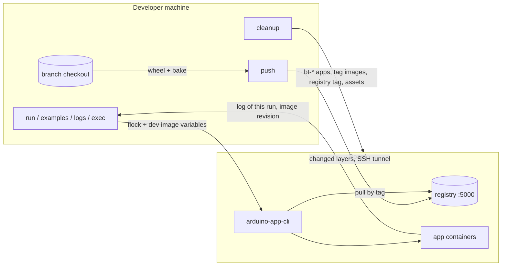

# arduino-test-buddy

Test App Bricks on a real Arduino board from your machine. One binary, two faces: a CLI for you and CI, an MCP server for Claude Code and other agents. Same operations, same structured results.

It replaces the SSH juggling of a board test session with a handful of calls that cannot step on each other: builds and pushes go through a registry on the board so only changed layers travel, every `arduino-app-cli` call is serialized, logs come back cut to the current run, and cleanup removes only what the session created.

## Install

Needs Go 1.26, Docker with buildx, [Task](https://taskfile.dev), uv, and an SSH alias for the board in `~/.ssh/config`.

```console
$ go install github.com/robgee86/arduino-test-buddy/cmd/arduino-test-buddy@latest
$ claude mcp add --scope user arduino-test-buddy -- arduino-test-buddy mcp   # optional, for Claude Code in every project
```

## Quickstart

From an `app-bricks-py` checkout of the branch to test:

```console
$ arduino-test-buddy --board ventunoq push                      # wheel + every image, pushed to the board; prints the tag
$ arduino-test-buddy --board ventunoq --tag my-branch preflight  # disk, CLI, apps, images, devices, as facts
$ arduino-test-buddy --board ventunoq --tag my-branch run --dir ./bt-mytest
$ arduino-test-buddy --board ventunoq --tag my-branch examples --brick weather_forecast
$ arduino-test-buddy --board ventunoq --tag my-branch run examples:bricks/arduino/weather_forecast/01_weather_forecast_by_city_example
$ arduino-test-buddy --board ventunoq --tag my-branch cleanup --brick weather_forecast
```

`--board` and `--tag` can come from `ARDUINO_BOARD` and `ARDUINO_BOARD_TAG`; `--format json` prints the full result. A test app is a normal app folder whose `main.py` prints `BOARD-TEST PASS|FAIL: <check>` lines and ends with `BOARD-TEST SUMMARY: <passed>/<total>`; `run` returns as soon as that line appears.

## How a session flows



Timings measured on a VENTUNO Q over Wi-Fi: first push of all containers under 4 minutes after the one-time build, a repeat push 47 seconds, a test app run about 50 seconds including the pull.

## Documentation

- [docs/operations.md](docs/operations.md), what each operation does and guarantees
- [docs/mcp.md](docs/mcp.md), the MCP tools, timeouts and images loaded by hand
- [docs/development.md](docs/development.md), building, testing, CI and releases

## License

GPL-3.0-or-later. See [LICENSE](LICENSE).
